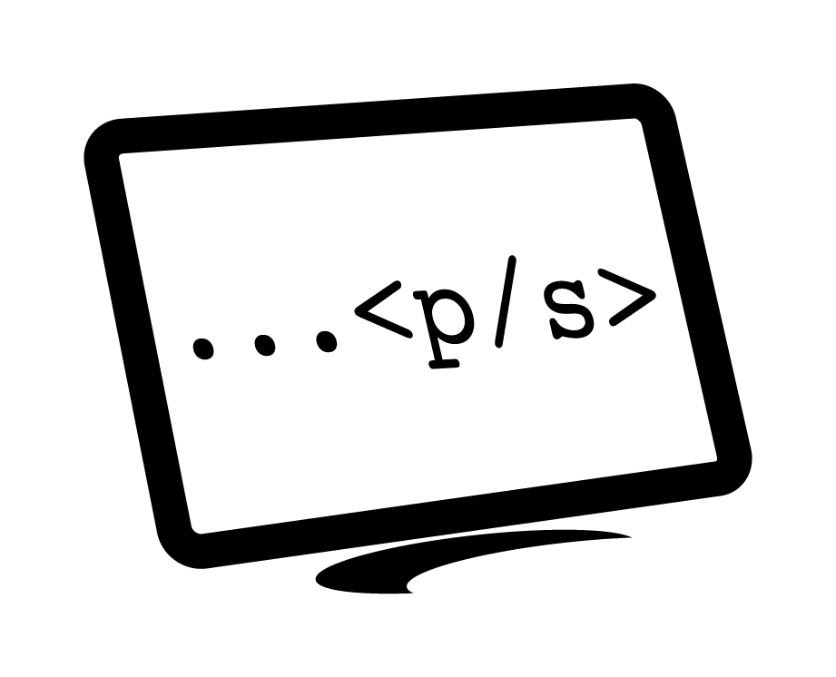
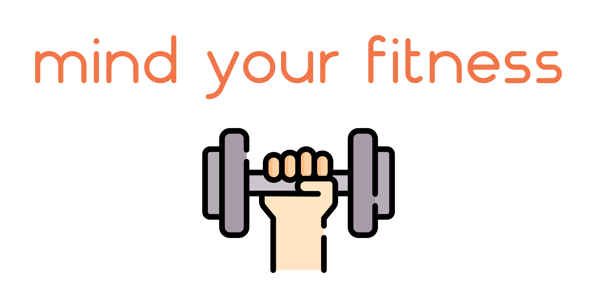
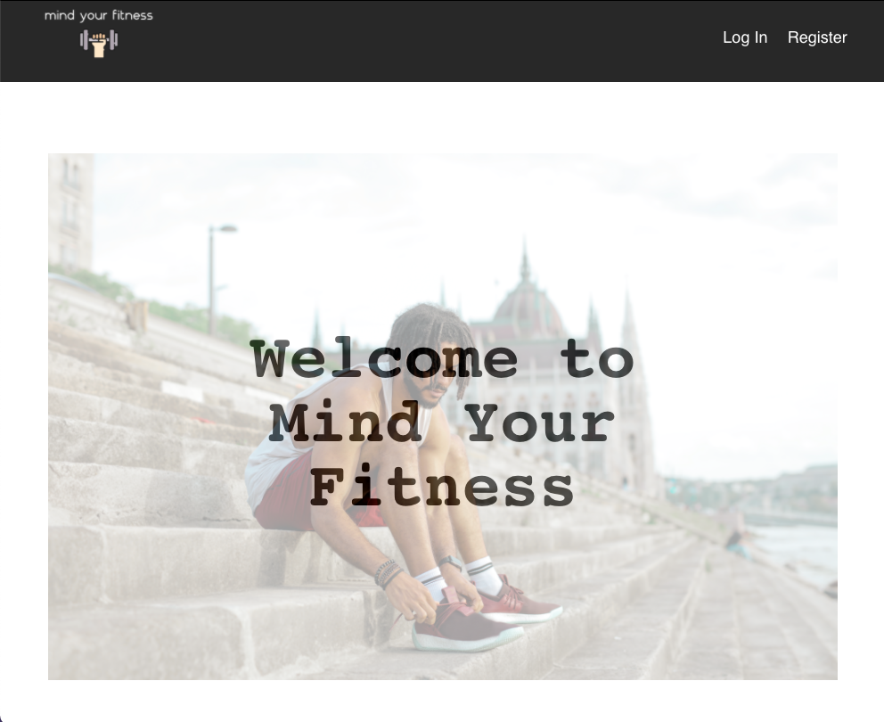
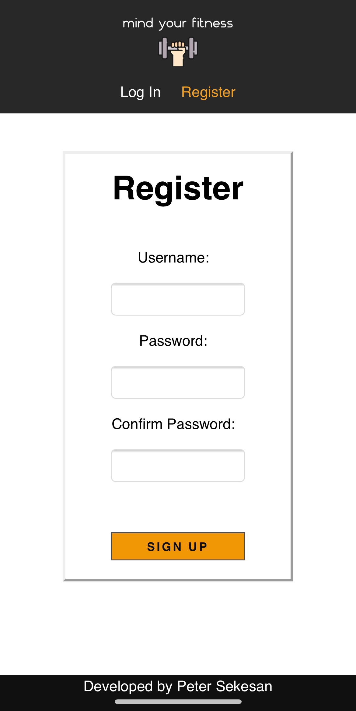
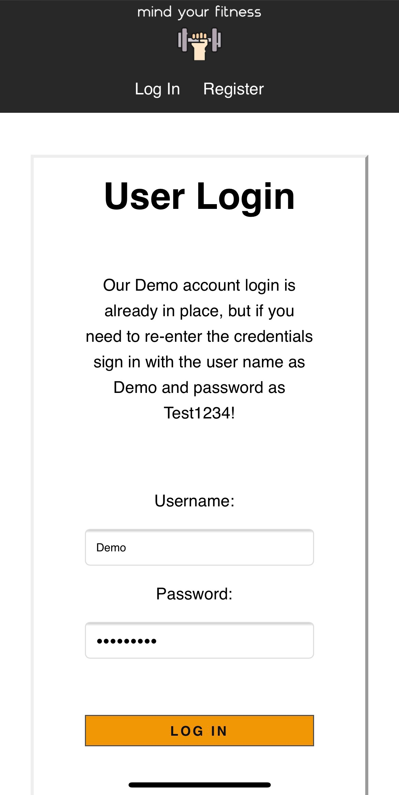
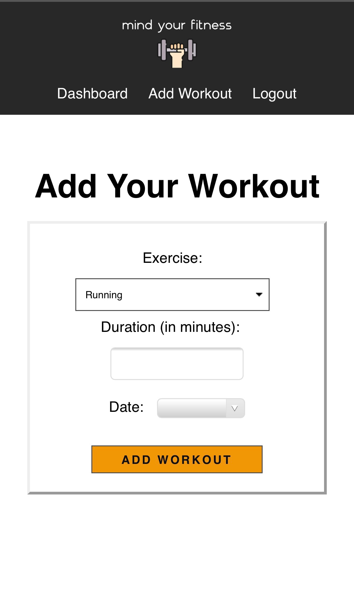
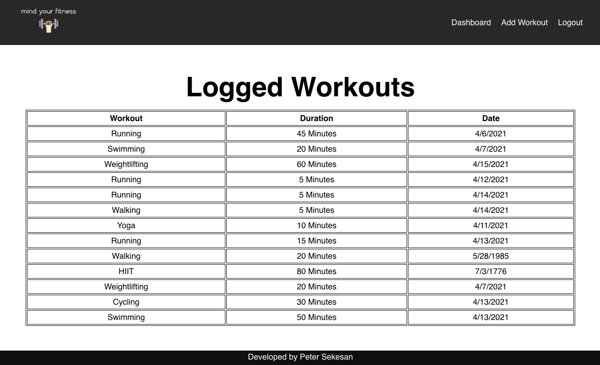

<!-- PROJECT LOGO -->
 

  

  <h3 align="center">Mind Your Fitness</h3>

  

    A simple exercise logging application.
     
     
    <a href="https://mind-your-fitness.vercel.app/">View Demo</a>
    ·
    <a href="https://github.com/Pete-Sekesan/mind-your-fitness/issues">Report Bug</a>
    ·
    <a href="https://github.com/Pete-Sekesan/mind-your-fitness/issues">Request Feature</a>
  

<!-- ABOUT THE PROJECT -->

## About The Project

  

This app was created to allow users to have a small, standalone application to log and keep track of their exercise's and to view them all in one central location. Setting up an account is easy. Just create a user name and password and you will be able to select from a list of predefined workouts. If you want to take a look around as well, you can log in with our Demo Account to give it a shot.

### Built With

- [HTML](https://developer.mozilla.org/en-US/docs/Web/HTML)
- [CSS](https://developer.mozilla.org/en-US/docs/Web/CSS)
- [JavaScript](https://www.javascript.com/)
- [React](https://reactjs.org/docs/getting-started.html)
- [Node.js](https://nodejs.org/en/docs/)
- [Express](https://expressjs.com/)
- [PostgreSQL](https://www.postgresql.org/)
- [Knex](http://knexjs.org/)

<!-- USAGE EXAMPLES -->

## Usage

Once logged in for the first time, go ahead and select the "Add Workout" option. From there, you can select from a predetermined set of popular exercises. Once you have selected the chosen workout, enter the amount of time you worked out for in minutes. Finally, go ahead a select the date it was done on. You can even go back and add workouts from prior days in the year. Enjoy!

<!-- ROADMAP -->

<!-- SCREEN SHOTS -->

## Screen Shots

### Landing page desktop view

### Register page mobile view

### Login page mobile view

### Add workout page mobile view

### User dashboard page desktop view

## Roadmap

See the [open issues](https://github.com/Pete-Sekesan/mind-your-fitness/issues) for a list of proposed features (and known issues).

## Contact

Twitter - [@PeterSekesan](https://twitter.com/PeterSekesan)  
psekesan@gmail.com

Portfolio: https://peter-sekesan.dev

Project Link: [https://github.com/Pete-Sekesan/mind-your-fitness](https://github.com/Pete-Sekesan/mind-your-fitness)

Project API Link: [https://github.com/Pete-Sekesan/mind-your-fitness-api](https://github.com/Pete-Sekesan/mind-your-fitness-api)
